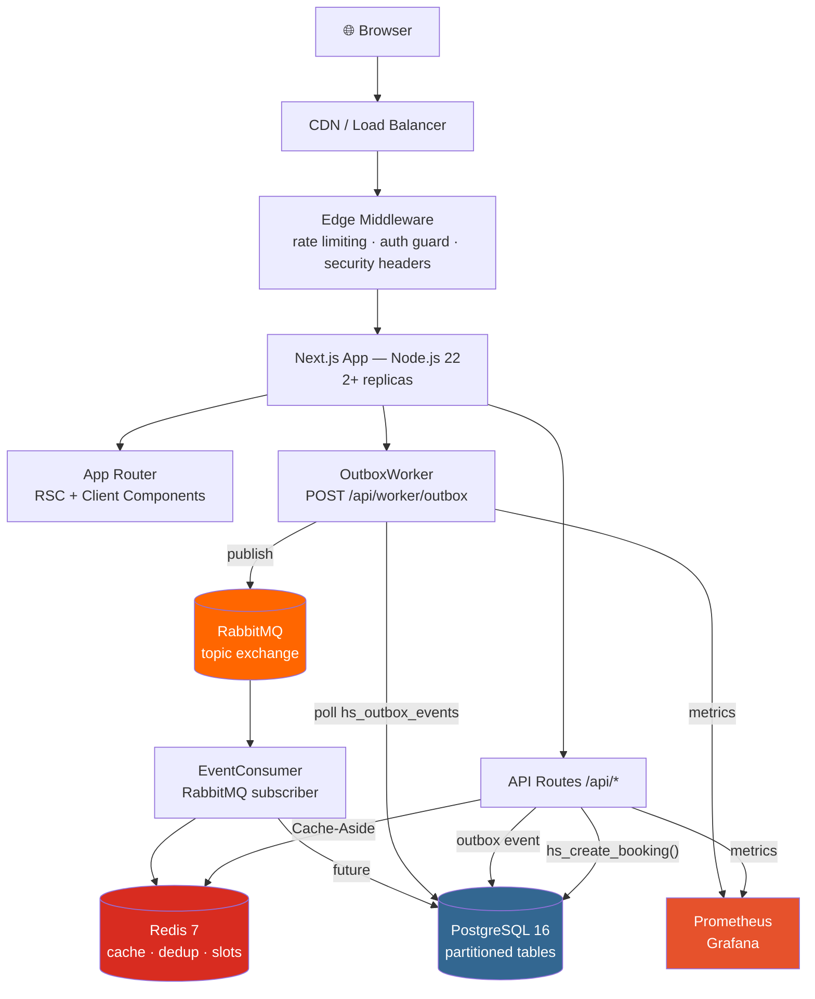
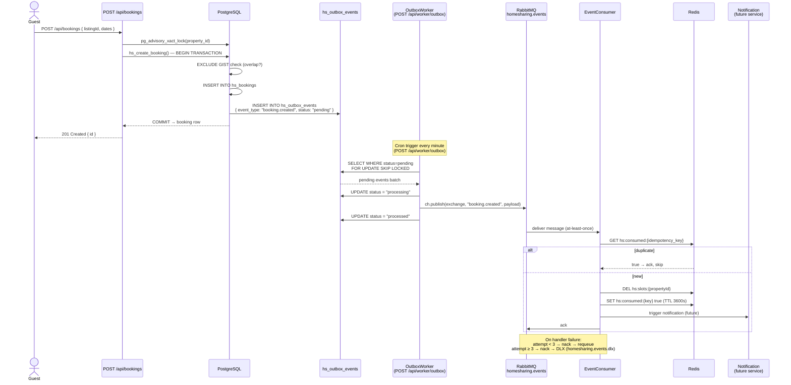

# HomeSharing Platform — Architecture

## Overview

HomeSharing — это монолитное Next.js-приложение с компонентами highload-готовности:
event-driven доставкой, Redis-кэшированием, партиционированными таблицами PostgreSQL
и наблюдаемостью через Prometheus/Grafana.



---

## Data Layer

### PostgreSQL 16

**Схема:** `scripts/migrations/002_highload_schema.sql`

| Таблица                   | Описание                                    | Особенности                                    |
|---------------------------|---------------------------------------------|------------------------------------------------|
| `hs_users`                | Пользователи (ESIA + local)                 | UUID PK, email unique                          |
| `hs_profiles`             | Расширенный профиль                         | 1:1 с hs_users                                 |
| `hs_properties`           | Объявления об аренде                        | pg_trgm FTS, GiST индексы                      |
| `hs_bookings`             | Бронирования                                | RANGE-партиционирование по году                |
| `hs_payments`             | Платежи                                     | Партиционирование по кварталу                  |
| `hs_outbox_events`        | Transactional outbox                        | Статус, retry_count, scheduled_at              |
| `hs_audit_logs`           | Аудит изменений                             | Партиционирование по кварталу                  |

#### ERD — основные сущности

```mermaid
erDiagram
    hs_users {
        uuid    id            PK
        varchar email
        varchar role
        boolean is_admin
        integer version
        tstz    created_at
        tstz    deleted_at
    }
    hs_profiles {
        uuid    id            PK
        uuid    user_id       FK
        varchar name
        varchar phone
        varchar avatar_url
    }
    hs_properties {
        uuid       id           PK
        uuid       owner_id     FK
        varchar    title
        varchar    deal_type
        numeric    price
        varchar    city
        varchar    address
        numeric    latitude
        numeric    longitude
        numeric    average_rating
        integer    review_count
        integer    version
        tstz       deleted_at
    }
    hs_property_photos {
        uuid    id           PK
        uuid    property_id  FK
        varchar url
        boolean is_primary
    }
    hs_bookings {
        uuid              id           PK
        uuid              property_id  FK
        uuid              guest_id     FK
        uuid              host_id      FK
        date              date_from
        date              date_to
        hs_booking_status status
        numeric           total_price
        integer           version
        tstz              created_at
    }
    hs_booking_status_history {
        uuid              id         PK
        uuid              booking_id FK
        hs_booking_status from_status
        hs_booking_status to_status
        uuid              changed_by FK
        tstz              created_at
    }
    hs_payments {
        uuid              id         PK
        uuid              booking_id FK
        uuid              user_id    FK
        numeric           amount
        hs_payment_status status
        varchar           external_id
    }
    hs_reviews {
        uuid     id           PK
        uuid     booking_id   FK
        uuid     property_id  FK
        uuid     reviewer_id  FK
        smallint rating
        boolean  is_from_guest
    }
    hs_favorites {
        uuid user_id     PK-FK
        uuid property_id PK-FK
    }
    hs_notifications {
        uuid    id      PK
        uuid    user_id FK
        varchar type
        boolean is_read
    }
    hs_outbox_events {
        uuid    id              PK
        varchar aggregate_type
        uuid    aggregate_id
        varchar event_type
        jsonb   payload
        varchar status
        smallint retry_count
        tstz    scheduled_at
    }
    hs_audit_logs {
        uuid    id          PK
        uuid    user_id     FK
        varchar action
        varchar entity_type
        uuid    entity_id
        jsonb   old_values
        jsonb   new_values
        tstz    created_at
    }

    hs_users      ||--o|  hs_profiles              : "has profile"
    hs_users      ||--o{  hs_properties             : "owns"
    hs_users      ||--o{  hs_bookings               : "guest"
    hs_users      ||--o{  hs_bookings               : "host"
    hs_properties ||--o{  hs_property_photos        : "has photos"
    hs_properties ||--o{  hs_bookings               : "booked via"
    hs_bookings   ||--o{  hs_booking_status_history : "status trail"
    hs_bookings   ||--o{  hs_payments               : "paid via"
    hs_bookings   ||--o{  hs_reviews                : "reviewed in"
    hs_properties ||--o{  hs_reviews                : "has reviews"
    hs_users      ||--o{  hs_favorites              : "saves"
    hs_properties ||--o{  hs_favorites              : "saved as"
    hs_users      ||--o{  hs_notifications          : "receives"
    hs_users      ||--o{  hs_audit_logs             : "audited"
```

#### Предотвращение двойного бронирования

Три уровня защиты:

1. **PostgreSQL advisory lock** (`pg_advisory_xact_lock`):  
   Сериализует одновременные запросы на одну и ту же property.

2. **EXCLUDE USING GIST**:  
   Запрещает перекрывающиеся `daterange` на уровне БД (per partition, т.к. PG 14+).

3. **`FOR UPDATE SKIP LOCKED`**:  
   Application-level проверка конфликтов до INSERT.

```sql
-- Атомарная функция бронирования
SELECT hs_create_booking(
    p_property_id  := $1,
    p_guest_id     := $2,
    p_date_from    := $3,
    p_date_to      := $4,
    ...
);
-- Возвращает booking_id или RAISE 'DATES_OVERLAP'
```

#### Партиционирование

```sql
-- hs_bookings — RANGE по created_at (год)
hs_bookings_2025, hs_bookings_2026, hs_bookings_2027, ...

-- Автосоздание следующей партиции:
SELECT hs_create_next_booking_partition();  -- вызывать через pg_cron
```

#### Full-text search

```sql
-- pg_trgm gin-индекс на title || ' ' || address || ' ' || city
CREATE INDEX hs_properties_fts_gin ON hs_properties
    USING GIN (to_tsvector('russian', title || ' ' || coalesce(address,'') || ' ' || city));
```

---

## Caching (Redis)

**Реализация:** `src/shared/lib/cache/redisCache.ts`

```
Cache-Aside pattern:
  read  → get(key) → HIT: return  |  MISS: DB → set(key, TTL) → return
  write → DB update → del(key) / invalidatePattern(prefix*)
```

| Namespace              | TTL     | Инвалидация                              |
|------------------------|---------|------------------------------------------|
| `hs:listings:{hash}`   | 300 s   | После создания/удаления объявления       |
| `hs:property:{id}`     | 600 s   | После обновления конкретного объявления  |
| `hs:session:{userId}`  | 86400 s | При logout / смене роли                  |
| `hs:search:{hash}`     | 120 s   | Пассивный TTL                            |
| `hs:slots:{propId}`    | 60 s    | После создания бронирования              |

Graceful degradation: если Redis недоступен, все операции — no-op, запросы идут в БД напрямую.

---

## Event-Driven Architecture

**Паттерн: Transactional Outbox**

```
Domain Change (e.g. booking created)
  │
  ├── INSERT into hs_bookings        ┐
  └── INSERT into hs_outbox_events   ┘  атомарно в одной транзакции
                │
                ▼
         OutboxWorker (polling every 5s)
                │
                ▼
          RabbitMQ topic exchange: homesharing.events
                │
          routing key = event_type (e.g. "booking.created")
                │
          ┌─────┴──────┐
          ▼            ▼
   notification-  analytics-
   service        service
```

#### Event Flow — полный путь события



**Retry policy (OutboxWorker):**
- Попытка 1: сразу
- Попытка 2: +5 с
- Попытка 3: +25 с
- Dead-letter: запись в `hs_outbox_events.status = 'dead_letter'`

**Типы событий:** `src/shared/lib/events/types.ts`

```typescript
'booking.created' | 'booking.confirmed' | 'booking.cancelled' |
'payment.completed' | 'payment.failed' |
'property.created' | 'property.updated' | 'property.deleted' |
'user.registered' | 'verification.completed' | 'notification.created'
```

---

## Rate Limiting

**Реализация:** `src/middleware.ts` (Edge Middleware)

| Endpoint                              | Лимит    | Окно   |
|---------------------------------------|----------|--------|
| Все остальные                         | 100 req  | 1 мин  |
| `/api/bookings`, `/api/host`, `/api/me` | 30 req   | 1 мин  |
| `/api/health`, `/api/metrics`         | Exempt   | —      |

Алгоритм: Sliding Window (in-memory Map, eviction каждые 60 с).  
В production — заменить на Upstash Redis + @upstash/ratelimit.

Ответ при превышении:
```json
{ "error": "Too Many Requests", "retryAfter": 42 }
// + headers: X-RateLimit-Limit, X-RateLimit-Remaining, X-RateLimit-Reset, Retry-After
```

---

## Observability

### Prometheus Metrics (`src/shared/lib/metrics/prometheus.ts`)

| Метрика                          | Тип       | Описание                           |
|----------------------------------|-----------|------------------------------------|
| `http_requests_total`            | counter   | По method/route/status             |
| `http_request_duration_ms`       | histogram | P50/P95/P99                        |
| `db_query_duration_ms`           | histogram | По operation                       |
| `cache_operations_total`         | counter   | hit/miss/set/del                   |
| `booking_conflicts_total`        | counter   | Заблокированных двойных бронирований |
| `outbox_events_total`            | counter   | По status (published/failed/dead_letter) |

Scrape endpoint: `GET /api/metrics` (Bearer token auth).

### Structured Logging (`src/shared/lib/logger/logger.ts`)

```json
{
  "level": "info",
  "service": "homesharing-app",
  "timestamp": "2026-05-12T10:00:00.000Z",
  "correlationId": "req-uuid",
  "message": "Booking created via DB function",
  "bookingId": "...",
  "listingId": "..."
}
```

Child loggers: `logger.child({ correlationId, userId })` — наследуют контекст.

### Grafana Dashboards

Provisioning: `docker/grafana/provisioning/`

Рекомендуемые дашборды:
- **HTTP Overview**: RPS, error rate, P95 latency
- **Booking Pipeline**: conflicts/min, outbox queue depth
- **Cache Efficiency**: hit rate, miss rate

---

## Security

### Response Headers (Edge Middleware)

```
X-Content-Type-Options:  nosniff
X-Frame-Options:         SAMEORIGIN
Referrer-Policy:         strict-origin-when-cross-origin
X-XSS-Protection:        1; mode=block
Permissions-Policy:      camera=(), microphone=(), geolocation=(self)
Strict-Transport-Security: max-age=63072000; includeSubDomains; preload  [prod only]
```

### Auth Guard

Protected prefixes: `/host`, `/admin`, `/settings`, `/bookings`, `/favorites`, `/messages`, `/notifications`

Redirect → `/login` при отсутствии сессионного токена.

---

## Infrastructure

### Docker (Development)

```bash
docker compose up -d           # все сервисы
docker compose --profile full up -d  # + prometheus + grafana
```

Сервисы:
| Сервис      | Port  | Описание                    |
|-------------|-------|-----------------------------|
| app         | 3000  | Next.js                     |
| postgres    | 5432  | PostgreSQL 16               |
| redis       | 6379  | Redis 7                     |
| rabbitmq    | 5672  | AMQP                        |
| rabbitmq-ui | 15672 | Management UI (dev only)    |
| prometheus  | 9090  | Metrics scraper             |
| grafana     | 3001  | Dashboards                  |

### Docker (Production)

```bash
docker compose -f docker-compose.yml -f docker-compose.prod.yml up -d
```

Отличия:
- Replica count: 2 для app
- Postgres: увеличены `shared_buffers=512MB`, `effective_cache_size=2GB`
- Redis: `requirepass` + append-only persistence
- RabbitMQ Management UI: отключён (используется plain image)
- Prometheus: retention 30d / 10GB
- Grafana: анонимный доступ отключён

---

## Load Testing (k6)

```bash
# Тест двойного бронирования (50 VUs, один слот)
k6 run --env BASE_URL=http://localhost:3000 \
        --env AUTH_TOKEN=<jwt> \
        --env LISTING_ID=<uuid> \
        scripts/k6/booking-load-test.js

# Тест поиска под нагрузкой (100 VUs peak)
k6 run --env BASE_URL=http://localhost:3000 \
        scripts/k6/search-load-test.js
```

**Целевые метрики:**

| Сценарий           | P95      | P99      | Error rate |
|--------------------|----------|----------|------------|
| Booking POST       | < 500 ms | < 1000 ms | < 1%      |
| Listings search    | < 300 ms | < 800 ms  | < 0.5%    |
| Listing detail     | < 150 ms | —         | < 0.5%    |

---

## Environment Variables

Полный список: `.env.example`

Ключевые переменные:

```env
DATABASE_URL=postgresql://...
REDIS_URL=redis://...
RABBITMQ_URL=amqp://...
NEXT_PUBLIC_YANDEX_MAPS_KEY=...
METRICS_AUTH_TOKEN=...
RATE_LIMIT_WINDOW_MS=60000
RATE_LIMIT_MAX_REQUESTS=100
RATE_LIMIT_API_MAX=30
```
